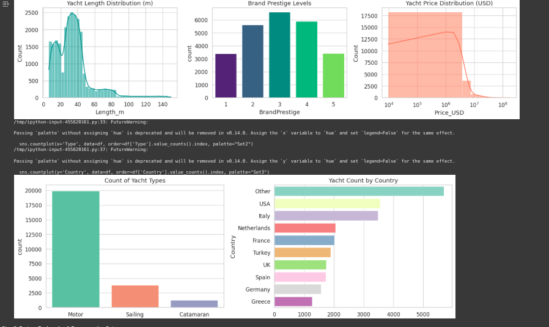

# 🚤 Cerebra Yacht Price Predictor  

### The Future of Yacht Pricing, Reimagined. 

What happens when **AI engineering passion** meets **next-level Cerebra-inspired design**?  
You get **the yacht price predictor that slaps harder than market waves.** 🌊  

This is **not just another ML project** — it’s a full-blown **Cerebra-style neural beast** trained to understand the deep layers of yacht pricing. With accuracy, flair, and an **interactive CLI control panel**, it’s your co-captain in navigating the seas of fair yacht valuation.  

🔥 Built with caffeine, and innovation by **Muhammad Shaheer** & **Irmak Güney**.  

---

## 🚀 Why This Slaps
- ⚡ High-accuracy predictions on luxury yacht pricing.  
- 🧠 Cerebra-inspired model architecture (beyond Transformers).  
- 🎮 Fun interactive **CLI Control Panel** that feels like a yacht cockpit.  
- 📊 Visual insights and analytics baked in.  
- 🌍 Global features: country, year built, length, type, brand prestige.  

---

## 🎥 Quick Demo
👉 Wanna try it live? Run the collab notebook here:  
[**Open in Google Colab**](https://colab.research.google.com/drive/1cW0UqPpxMQ5XRQ9jMbDYHUMrrmea2-T2?usp=sharing)  

---

## 📊 Visualization
Here’s where the magic comes alive.  

  

---

## 🏁 How to Run

Follow these simple steps to get the yacht price predictor sailing:

1. **Open the Google Colaboratory Notebook**  
   Click here: [**Open in Colab**](https://colab.research.google.com/drive/1cW0UqPpxMQ5XRQ9jMbDYHUMrrmea2-T2?usp=sharing)  

2. **Upload the Dataset**  
   Download `yacht_prices_25k.csv` from this GitHub repo.  
   Upload it to the Colab notebook when prompted.  

3. **Run All Cells**  
   Start from the top and run all code cells in order.  
   This will:
   - Load and preprocess the dataset  
   - Train the Cerebra-style model  
   - Prepare the interactive CLI for predictions  

4. **Use the CLI**  
   After training, run the command:  
   ```
   run_control_panel()
   ```
The panel will ask you 5 questions about your yacht: country, year, type, length, and brand prestige.

Enter your answers naturally.

It will output a predicted fair price for your yacht. 🎯

Enjoy exploring yacht pricing like never before! 🚤💨


---------------

## ⚡ How It Feels to Use
When you run the CLI:  
- It asks you fun, natural questions like a yacht dealer.  
- You punch in answers.  
- It shoots back with **a price prediction that feels legit.**  
- All wrapped in emojis, smooth text, and energy.  

Think of it as a **control panel** where AI meets luxury.  

---

## 🛠️ Tech Vibes
- **Python** + **PyTorch**  
- **Custom Cerebra-inspired architecture**  
- **Sklearn scaling & encoding**  
- **Interactive CLI** with styled Q&A  

---

## ⚖️ License
MIT License — free to use, remix, and sail away.  

---

## 💡 Credits
Built collaboratively by:  
- **Muhammad Shaheer**  
- **Irmak Güney**  

Because collaboration fuels innovation. ⚡  

---

# ✨ Final Word
This isn’t just code.  
This is **luxury AI**.  
This is **the yacht price predictor**.  
And it’s ready to set sail. 🚤💨  

